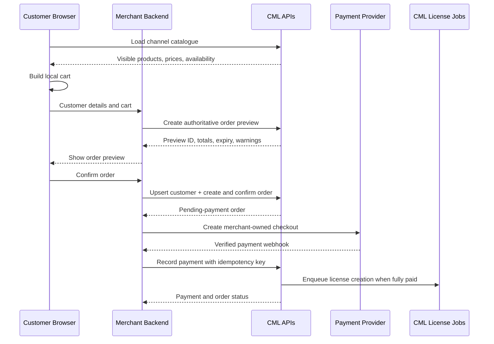

# CML Marketplace SDK user guide

This guide explains how another CheckMyLicense merchant can build a storefront
with CML Marketplace.

## 1. Understand the ownership boundary

CML is the reference for:

- sales-channel catalogue and product availability;
- authoritative prices and discounts;
- customers and orders;
- payment records and order status;
- asynchronous licence creation.

The merchant owns:

- the website and cart interface;
- the payment-provider checkout;
- validation of Stripe, PayPal, or other provider webhooks;
- the server route that records a verified payment with CML.

The SDK is not a hosted checkout and should never receive a merchant's provider
credentials.

## 2. Prepare CheckMyLicense

Before integrating the SDK, the merchant should:

1. Create a program and at least one version in CML.
2. Create one or more products linked to that program.
3. Create and activate a sales channel.
4. Add the products to the channel, choose their visibility and order, and
   select at most one default product per program.
5. Confirm the intended countries are allowed.
6. Copy the channel's stable slug.
7. Preview the catalogue in CML for both an allowed and a restricted country.

The storefront must use the channel response exactly. It must not invent
products, prices, defaults, or country availability.

### Catalogue outcomes

| CML result | Storefront behavior |
| --- | --- |
| Active catalogue with products | Display the returned products in their returned order |
| Active catalogue with no visible products | Display an empty catalogue |
| `available: false` | Display CML's fallback message and no products |
| Unknown or inactive channel (`404`) | Display “Catalogue not found” and disable checkout |
| Authentication or permission error | Display a connection error and no products |

## 3. Create a server API key

Create a key in CML under the organization's integration settings. A complete
storefront normally needs:

| Scope | Purpose |
| --- | --- |
| `ecommerce:read` | Read the catalogue and orders |
| `ecommerce:customers:write` | Create customers |
| `ecommerce:orders:write` | Preview, submit, and confirm orders |
| `ecommerce:payments:record` | Record verified provider payments |

Add `ecommerce:orders:cancel` only if the integration supports cancellation or
refund workflows.

The API secret must exist only in the merchant backend. Never expose it through
Vite variables, client JavaScript, HTML, logs, or provider metadata.

## 4. Get the SDK

### Current development release

The packages are currently workspace packages and are not yet published to
npm. A developer can use the repository directly:

```bash
git clone https://github.com/MitalioHQ/cmlmarketplace.git
cd cmlmarketplace
npm install
copy .env.example .env.local
npm run dev
```

The repository contains:

- `@cml-marketplace/core` for cart, money, and shared commerce types;
- `@cml-marketplace/catalog` for browser-safe access to a merchant catalogue
  proxy;
- `@cml-marketplace/server` for server-only HMAC calls to CML;
- `@cml-marketplace/demo-store` as the reference implementation.

### After the packages are published

The intended installation will be:

```bash
npm install @cml-marketplace/core @cml-marketplace/catalog
npm install @cml-marketplace/server
```

Applications should pin a compatible version and upgrade intentionally.

## 5. Configure the merchant backend

Create an ignored `.env.local`:

```dotenv
CML_API_KEY=replace-with-the-merchant-key
CML_API_SECRET=replace-with-the-merchant-secret
CML_CHANNEL_SLUG=replace-with-the-channel-slug
CML_DEFAULT_COUNTRY=FR
CML_API_BASE_URL=https://vwqretlvkrravzguxydw.functions.eu-west-2.nhost.run/v1
```

Initialize the server client:

```ts
import { createCmlApiClient } from "@cml-marketplace/server";

const cml = createCmlApiClient({
  apiKey: process.env.CML_API_KEY!,
  apiSecret: process.env.CML_API_SECRET!,
  baseUrl: process.env.CML_API_BASE_URL,
});
```

The client hashes the exact JSON body and signs it with HMAC-SHA256. The secret
is used to calculate the signature but is never transmitted to CML.

## 6. Load the catalogue

The merchant backend requests:

```ts
const catalogue = await cml.getCatalog({
  channel: process.env.CML_CHANNEL_SLUG!,
  country_code: customerCountry,
});
```

Expose a safe merchant route such as:

```text
GET /api/catalog?country=FR
```

The browser can use the catalogue package against that route:

```ts
import { createCatalogClient } from "@cml-marketplace/catalog";

const catalogueClient = createCatalogClient({
  baseUrl: window.location.origin,
});

const catalogue = await catalogueClient.getCatalog({
  channelSlug: "northstar",
  countryCode: "FR",
});
```

The reference demo proxies catalogue access through the merchant backend
because the deployed catalogue endpoint uses server HMAC authentication.

## 7. Build the cart in the browser

Store only CML product IDs, quantities, and optional activation targets:

```ts
const cartItem = {
  productId: "15",
  quantity: 1,
  targetId: "12345",
  targetHost: "mt5.broker.com",
};
```

Prices displayed in the cart are estimates from the catalogue. Never send a
browser-provided price as authoritative. CML calculates the preview and final
order totals.

## 8. Create the customer and preview the order

Submit customer details and cart items to the merchant backend. The backend:

1. Creates the CML customer with `/order/customer`.
2. Stores the returned CML customer ID.
3. Calls `/order/submit` with `preview: true`.
4. Returns CML's totals, warnings, and product snapshots to the browser.

Current API limitation: the public customer endpoint creates customers and
rejects duplicate emails. It does not currently expose lookup by email or
native upsert. A production integration should persist the CML customer ID in
its own customer mapping. It must not claim an upsert succeeded when CML
returned a duplicate conflict.

## 9. Submit and confirm the order

After the customer accepts the preview, the merchant backend:

1. Calls `/order/submit` without preview to create a Draft order.
2. Reads the returned numeric order ID and stable order code.
3. Calls `/order/confirm` with the numeric ID.
4. Optionally calls `/order/get` using the order code.
5. Returns the Pending Payment order to the browser.

The order code should be stored in the merchant's checkout-session or provider
metadata so the verified webhook can identify the correct CML order.

## 10. Create any merchant-owned checkout

The merchant can use Stripe, PayPal, bank transfer, or another provider. CML
does not create or host this checkout.

Provider metadata should contain a stable reference to the CML order, but it
must not contain the CML API secret or sensitive customer data.

## 11. Process the payment webhook

The merchant backend must:

1. Verify the provider's webhook signature.
2. Confirm the event belongs to the expected merchant account.
3. Check the provider payment status and amount.
4. Extract the CML order code from trusted merchant data.
5. Call CML's `/order/payment` endpoint once.

Example:

```ts
await cml.recordPayment({
  order_code: cmlOrderCode,
  provider: "paypal",
  provider_txn_id: providerTransactionId,
  amount: capturedAmount,
  status: 1,
  payment_method: "card",
});
```

`provider_txn_id` must be stable and globally unique. Retrying the same provider
event must reuse the same transaction ID so CML can reject duplicate payment
records safely.

Do not call the payment API from the customer browser or from an unverified
success-page redirect.

## 12. Display order and fulfilment status

Once captured payments cover the order total, CML marks the order Paid and
queues licence creation. Licence creation is asynchronous, so a storefront
should distinguish:

- payment accepted;
- order paid;
- licence fulfilment pending;
- licence fulfilment completed or failed.

The merchant can read the current order using `/order/get`.

## 13. Test safely

Recommended test sequence:

1. Load an allowed catalogue country.
2. Load a restricted catalogue country.
3. Confirm an invalid slug displays no products.
4. Preview an order and verify totals without creating an order.
5. Submit and confirm one clearly labelled test order.
6. Treat the demo Pay button as a live CML mutation: it simulates the external
   provider, then records a captured payment in CML.
7. Use it only with an approved test order because the captured payment can
   mark it Paid and enqueue licence jobs.
8. Replay the same provider transaction ID and verify duplication is rejected.

## 14. Production checklist

- CML credentials exist only in server environment variables.
- Every API key has the minimum required scopes.
- The sales-channel slug is configured, not accepted blindly from the browser.
- Country codes use ISO 3166-1 alpha-2.
- The storefront never substitutes local catalogue products.
- CML customer IDs and order codes are persisted.
- Provider webhooks are cryptographically verified.
- Provider transaction IDs are stable and unique.
- Logs redact secrets, signatures, and sensitive customer fields.
- API errors and restricted catalogues fail closed.
- Payment and licence fulfilment are displayed as separate states.
- The integration has monitoring for failed webhooks and failed licence jobs.

## Technical sequence



The diagram expresses the intended SDK abstraction. In the current deployed
API, catalogue calls are server-proxied and customer creation happens before
preview, as described in the implementation sections above.
